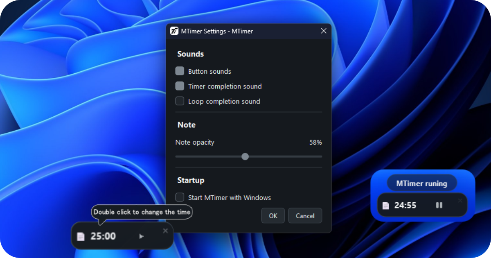

# MTimer

  

A tiny, lightweight timer widget for Windows.

MTimer stays visible above other windows and gives you a simple way
to keep track of time without taking over your screen.

## Features

- Always-on-top timer
- Custom timer labels and notes
- Auto start with Windows
- Small and lightweight
- Simple interface

## Download

Download the latest version of MTimer for Windows:

[Download MTimer](https://github.com/aavokaluk/MTimer/releases/latest)

## Website

https://mtimer-site.pages.dev/

## License

See the repository for license information.

## Support MTimer

If you find MTimer useful, you can support its development.

[❤️ Support the developer](https://www.patreon.com/cw/Vokaluk)

